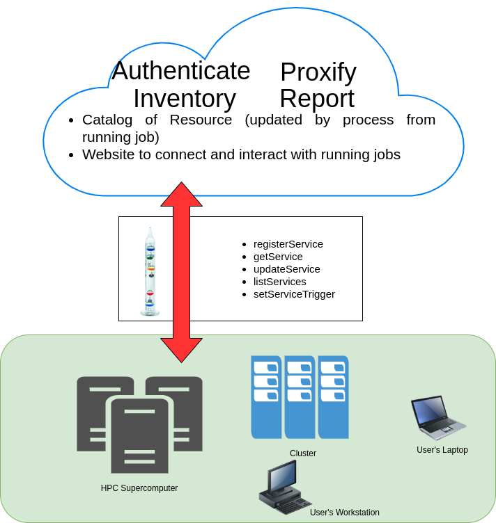

Welcome to Ludion's documentation!
====================================

*Ludion* is the French word for "Cartesian Diver" a classic science
experiment demonstrating the principle of Archimedes'principle.  It
consists of a diver trapped in a water bottle traveling down when a
pressure is applied at the top of the enclosure and back up when it is
released.

The movement of this diver portrays well the purpose of *Ludion* this
framework which goal is to spread valuable information back and forth
from HPC Resources  to an easy to use web interface
hosted in the AWS Cloud and vice versa.

Although all technical information can be found on the current
website, the following [Article]_ might be of interest to understand
the context of this work as it captures the motivations of *Ludion*'s
development, its functional architecture, some detail of
implementation as well as 10 use cases partially deployed at KAUST
Supercomputing Laboratory.

.. toctree::
   :maxdepth: 3
   :caption: User Documentation

	     
   what_is_ludion
   install
   API
   use cases
   

.. [Article] Towards an HPC Service Oriented Hybrid Cloud Architecture
  Designed for Interactive Workflows, Samuel KORTAS & Moshin SHAIKH,
  submitted in September 2020, available on request.
