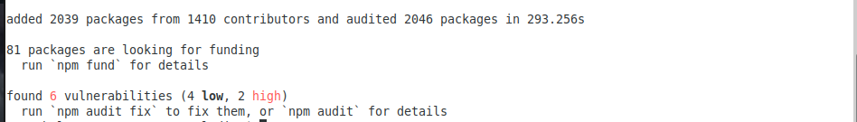

Installation
============

Requirements
------------

*Ludion* does not require any super priviledge. It can be
installed by a regular user as long as he possess an AWS
account to install *Ludion* centralized services.

Distribution
------------

*Ludion* is an open-source project distributed under the BSD
2-Clause "Simplified" License which means that many possibilities are
offered to the end user including the fact to embed *Ludion* in
one own software.

Its stable production branch is available via github at
https://github.com/samkos/ludion where its latest production and
development branch can be found

The most recently updated  documentation can be browsed at
http://ludion.readthedocs.io.

Installing *Ludion* 
--------------------
*Ludion* is composed of:

- a centralized dashboard and a GraphQL interface, hosted on a set of
  AWS serverless Resources, deployed thanks to *AWS Amplify*
- a set of scripts executable in a Unix shell to be installed on the
  connected Resources to connect to this centralized dashboard.

Current source is available on  Github, use the following command to retrieve
the latest stable version from the repository:

::
    $ git clone git@github.com:samkos/ludion.git

Installing *Ludion* Centralized Services
----------------------------------------

*Ludion* relies on the following serverless AWS Components:

- 4 *DynamoDB* databases
- *AWS SES* to send mails,
- *Cognito user pool* to handle authentication of users
  that wish to connect to the website.
- *AWS Amplify* to deploy the dashboard and its
  corresponding *GraphQL* interface via *AWS Appsync*

Based on a *Cloud Formation* script, *Ludion* should be
straightforward to deploy on AWS Cloud. We are still working on a
fully automated installation, learning at the same time how to master
*Cloud Formation* for this case.

We are presenting here a semi-automated installation using shell
scripts and some amplify command that can not be scripted yet.

Prerequisites
^^^^^^^^^^^^^

This installation supposes that the current user

- has created an account on AWS
- has set up the AWS Email Service, SES in order to be able to send
  a mail from AWS

and that he installed on a local machine

- the aws cli (based on python)
- a recent version of nodeJS
- aws amplify

Deployment of the Dashboard in AWS cloud:
^^^^^^^^^^^^^^^^^^^^^^^^^^^^^^^^^^^^^^^^^

Let's deploy a version of *Ludion* that we will tag **prod**. Here are reproduced
below the steps to install the centralized dashboard of *Ludion* built on
serverless AWS components. At this stage, this steps are either automated either
still manual. For the manual parts, accepting all the default choices is
only required.

1. Clone the latest stable version of *Ludion* from  Github:
::
   $ git clone git@github.com:samkos/ludion.git LUDION_TEST

2. Initialize the amplify environment
::
   $ cd LUDION_TEST/ludion
   $ sh ../install/amplify_init.sh test

   Note: It is recommended to run this command from the root of your app directory

   For more information on AWS Profiles, see:
   https://docs.aws.amazon.com/cli/latest/userguide/cli-multiple-profiles.html

   Adding backend environment test to AWS Amplify Console app: d26x5q23er3ls4
   ⠴ Initializing project in the cloud...

   CREATE_IN_PROGRESS UnauthRole                 AWS::IAM::Role             Thu Nov 12 2020 15:30:08 GMT+0300 (Arabian Standard Time)               
   CREATE_IN_PROGRESS AuthRole                   AWS::IAM::Role             Thu Nov 12 2020 15:30:08 GMT+0300 (Arabian Standard Time)               
   CREATE_IN_PROGRESS amplify-ludion-test-152955 AWS::CloudFormation::Stack Thu Nov 12 2020 15:30:03 GMT+0300 (Arabian Standard Time) User Initiated
   ⠼ Initializing project in the cloud...

   ...

   ✔ Successfully created initial AWS cloud resources for deployments.
   ✔ Initialized provider successfully.
   ✔ All resources are updated in the cloud

   Initialized your environment successfully.

   Your project has been successfully initialized and connected to the cloud!

   Some next steps:
   "amplify status" will show you what you've added already and if it's locally configured or deployed
   "amplify add <category>" will allow you to add features like user login or a backend API
   "amplify push" will build all your local backend resources and provision it in the cloud
   "amplify console" to open the Amplify Console and view your project status
   "amplify publish" will build all your local backend and frontend resources (if you have hosting category added) and provision it in the cloud

   Pro tip:
   Try "amplify add api" to create a backend API and then "amplify publish" to deploy everything

3. Add the GraphQL API, providing the model schema from amplify_schema/schema.graphql and setting the expiration time of the API key to 365 days not to have to change it too often.
::
  $ amplify add api
  

4. Link to an authentication via cognito user pool
::
  $ amplify add auth

5. push the environment to the cloud
::
  $ sh ../install/amplify_push.sh

...
Updating resources in the cloud. This may take a few minutes...
...

  
6. create the website locally
::
  $ npm install

7. preparing the hosting place for the dashboard in the cloud
::
  $ amplify hosting add

8. pushing it to the cloud
::
  $ amplify publish
  

continuing
  

continuing
  

	   

Installing *Ludion* local components
^^^^^^^^^^^^^^^^^^^^^^^^^^^^^^^^^^^^

Executables are gathered in the *API/unix/* directory. Adding this
directory to *PATH* variable completes the installation of
*Ludion*,

