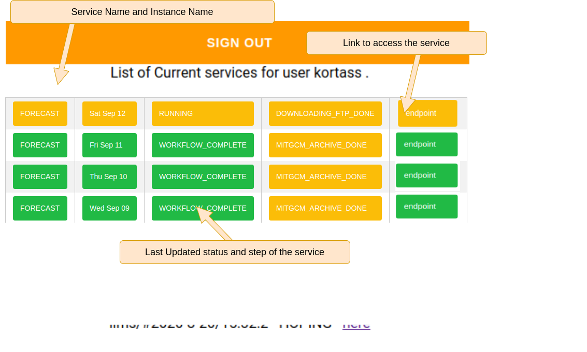

Typical use case: spawning a Jupyter Notebook
=============================================

Let's take the example of a Jupyter Notebook to be deployed from a
node of a cluster named *Ibex*. Let's assume that we are already
logged in on a node of this cluster, *Ibex_000xxx* and have checked
for the first port *Port_nnn* available and started a Jupyter Notebook
server responding on this port. We also eventually set up a random
password *Password_yyy* to secure access to the Notebook.

The fist step consists in registering Jupyter Notebook as the instance
*example* of the service we name *JupyterNotebook*:
::
  $ registerService --service JupyterNotebook
                    --instance example \
                    --endpoint http://Ibex_000xxx:Port_nnn
                    --password Password_yyy
  service JupyterNotebook:example registered		    

In the cloud, this newly registered service adds a new line in *Ludion*
centralized  database, and triggers the update of any browser pointing to 
*Ludion*'s Dashboad showing that a service JupyterNotebook is now ready
for the user to access at the address *http://Ibex_000xxx:Port_nnn* that
appears as a clickable link using the password *Password_yyy*
displayed with all other parameters of the service when clicking on
the service.

Once the service is registered, any parameter can be updated thanks to the
following command:
::
  $ updateService --service JupyterNotebook
                  --instance example
                  --status RUNNING
		  --step step_0.1
  service JupyterNotebook:example updated successfully

These parameters are immediately updated in the centralized database and on the
*Ludion* dashboard.

One can also retrieve given parameters of a given service
with the command:
::
   $ getService --service JupyterNotebook 
                --instance example 
                --parameters "endpoint,status,login,password,x1"
   { service  : "JupyterNotebook",
     instance : "example",
     endpoint : "Ibex_000123:2030",
     status   : "RUNNING"
     login    : "JupyterNotebook",
     password : "Password_yyy"
   }
		
More briefly, this command can be called with no parameter to get
only the status of the service:
::
   $ getService --service JupyterNotebook 
                --instance example 
   RUNNING
Or, to get all parameters with --all-parameters options
::
   $ getService --service JupyterNotebook 
                --instance example
		--all-parameters
   { service    : "JupyterNotebook",
     instance   : "example",
     id         : "JupyterNotebook_example_1141442334333311",
     description: "Jupyter service",
     user       : "user_login",
     machine    : "Ibex",
     endpoint   : "Ibex_000123:2030",
     status     : "COMPLETE",
     step       : "step_0.1", 
     password   : "Password_yyy",
     createdAt  : "2020-11-11 14:00:00",
     updatedAt  : "2020-11-11 14:10:410",
     jobid      " "012121544"
   }

