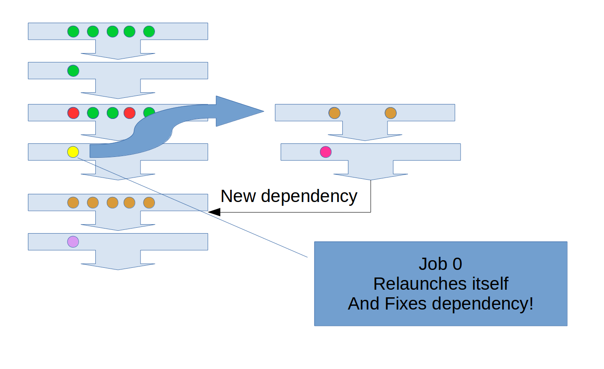

=====================
 What is *Ludion*?
=====================

Developped by the KAUST Supercomputing Laboratory (KSL), *Ludion* is
a SLURM extension written in Python allowing the user to handle jobs
per hundreds in an efficient and transparent way. In this context, the
constraint limiting the number of jobs per users is completely
masked. The time consuming burden of managing thousands of jobs by
hand is also alleviated by making available to the user the concept of
workflow gathering a set of jobs that he can manipulate as a whole.

*Ludion* is released as an Open Source Software under BSD Licence.
It is available at 

Features
--------

*Ludion* allows a user to:

- xxxx

xxx
---
  
In case of ...

Fully user configurable environment
-----------------------------------
	   
*Ludion* does not require any super priviledge. It can be
installed by a regular user as long as he possess an AWS
account to install *Ludion* centralized services.
